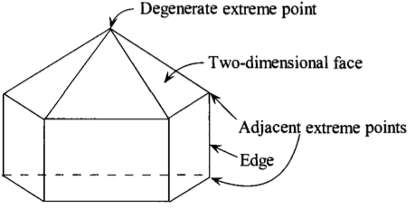
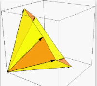

<div align="center">
  <h1>Homework 3</h1>
    <p>
        <div align="center">
        <h2>Yutong Dai yutongd3@illinois.edu</h2>
        </div>
    </p>
</div>

## 2.49

### a)
Yes. Consider the following setting:

Denote $A= \begin{bmatrix}1 & -1 \\ 1 & -1\end{bmatrix}$ and $b=(1,-1)^T$. Then the set $\{x|Ax \leq b; x\geq 0\}$ is empty while the set $\{d|Ad\leq 0; d\geq 0, 1^Td=0\}$ has a element of $(0.5, 0.5)^T$.

### b)
There's no relationship between these two. The left figure has a redundant defining plane (1), but has no degeneracy. While the second figure has 1 degree of degeneracy, but has no redundancy.




### c)
Yes. Because in three dimensions or higher, a degenerated extreme point can lie on more than 2 defining planes and remove any of it will change the polyhedron set while it is not true for 2-d space.

### d)
No. Consider $A= \begin{bmatrix}1 & 0 \\ 1 & 0\end{bmatrix}$ and $b=(2, 1)^T$ and the polyhedron set defined by $A$ and $b$, that is $\{x|Ax \leq b\}$. The intersection of two half spaces is $\{(x,y); x\leq 1, y\in R\}$, but there is no extreme point.

### e)
False. Consider a convex cone defined by $n+1$ hyper-planes, then it can have $n+1$ extreme directions. For example, the figure below has more than 3 extreme directions. (Source:Google Image.)



### f)
dim(X) = n - r.

## 2.50

We can have at most $C_6^4=15$ basic solutions. By the code following, we see there are only 13 basic solutions. Out of 13 basic solutions, there are only 4 basic feasible solutions, which implies we have 4 extreme points.

Extreme points are:
```
(0,1,0,1), (0,1,0,0), (0,0,0,1), (0,0,0,0)
```


```python
import numpy as np
A = np.array([[-1,1,-2,0], [-2,0,-1,2], [1,0,0,0], [0,1,0,0], [0,0,1,0], [0,0,0,1]])
b = np.array([[1],[2],[0],[0],[0],[0]])
root = {}
for i in range(0, A.shape[0]-3):
    for j in range(i+1, A.shape[0]-2):
        for k in range(j+1, A.shape[0]-1):
            for l in range(k+1, A.shape[0]):
                try: 
                    temp = np.linalg.solve(A[[i,j,k,l], :], b[[i,j,k,l],:])
                    root[str(i)+str(j)+str(k)+str(l)] = temp
                except np.linalg.LinAlgError:
                    pass
```

To find the extreme directions, it's  equivalent to find the basic feasible solutions of the $\{d | Ad\leq 0, d\geq 0\ 1^Td=0\}$.

Extreme directions are:

```
(0, 4/7, 2/7, 1/7)
(1/3, 1/3, 0, 1/3), (0, 0, 2/3, 1/3), (0, 2/3, 1/3, 0)
(0.5, 0, 0, 0.5), (0.5, 0.5, 0, 0)
(1,0,0,0), (0, 1, 0, 0), (0, 0, 1, 0), (0,0,0,1)
```


```python
A = np.array([[-1,1,-2,0], [-2,0,-1,2], [1,0,0,0], [0,1,0,0], [0,0,1,0], [0,0,0,1], [1,1,1,1]])
zero = np.array([[0],[0],[0],[0],[0],[0],[1]])
root = {}
for i in range(0, A.shape[0]-3):
    for j in range(i+1, A.shape[0]-2):
        for k in range(j+1, A.shape[0]-1):
                try: 
                    temp = np.linalg.solve(A[[i,j,k,6], :], zero[[i,j,k,6],:])
                    check = True
                    if np.sum([d<0 for d in temp]) > 0:
                        check = False
                    if check:
                        root[str(i)+str(j)+str(k)+str(6)] = [float(x).as_integer_ratio() for x in temp]
                except np.linalg.LinAlgError:
                    pass
```

Choose two extreme points $x_1=(0,1,0,1)$, $x_2=(0,1,0,0)$ and two extreme directions $d_1=(1,0,0,0)$ and $d_2=(0,0,0,1)$. Then 
$$0.5x_1 + 0.5x_2 + d_1 + 1.5 d_2 = (1,1,1,2).$$

## Exercise 2.6

a) 
If $n\leq m$, then the argument is trivial. Now suppose that $n>m+1$. Pick an arbitrary $y\in C$ and consider the polyhedral set

$$
P = \{\lambda=(\lambda_1,...\lambda_n)| \sum_{i=1}^m \lambda_i A_i=y\}.
$$


By the choice of $y$, we know that there exist an extreme point in P,say $x_0$ (corollary 2.2). So there are at least $n-m$ zero components in $\lambda$, which implies that there are at most $m$ nonzero components in $\lambda$. This concludes the proof.

b)

If $n\leq m$, then the argument is trivial.Now suppose that $n>m+1$. Pick an arbitrary $y\in C$ and consider the polyhedral set

$$
P = \{\lambda=(\lambda_1,...\lambda_n)| \sum_{i=1}^m \lambda_i A_i=y, \sum_{i=1}^n \lambda_i = 1\}.
$$

By the choice of $y$, we know that there exist an extreme point in P,say $x_0$ (corollary 2.2). So there are at least $n-m-1$ zero components in $\lambda$, which implies that there are at most $m+1$ nonzero components in $\lambda$. This concludes the proof.


## Exercise 2.10
a) **TRUE**

proof: WLOG, we assume $A=[A_1, A_2], x=(x_1,x_2)^T$, where $A_1, A_2, x_1, x_2$ are of dimension $m\times m, m\times 1, m\times 1, 1\times 1$ and $A_1$ are of rank $m$. Then we can rewrite $Ax=b$ as $A_1x_1 + A_2x_2=b$. As $A_1$ is invertible, $x_1=A_1^{-1}(b-A_2x_2)$, which implies the dimension of $X$ is actually 1. That is to say, the solutions are always of the form
$$
x= \begin{bmatrix}A_1^{-1}(b-A_2x_2) \\ x_2\end{bmatrix} \overset{\Delta}{=} \begin{bmatrix}a-cx_2 \\ x_2\end{bmatrix} 
$$
Note that if we have more than two basic feasible solution, say three, then they must lie on a line segment, which is contained with the $X$. Then the "middle" one can be represent as a strict convex combination of the remaining two, which leads to the contradiction of the definition of the extreme point.

b) **False**

Consider minimizing $0$, subject to $x\geq 0$. The optimal solution set $[0, \infty)$ is unbounded.

c) **False**

Consider the problem
$$
\min_{x\in X} 0, 
$$

then all $x\in X$ are optimal, but they are not necessarily to be a basic feasible solution.

d) **True**

The convex combination of any two optimal is another optimal solution.

e) **False**

$$
\begin{align*}
& \min_{x_2} x_2 \\
& s.t. \\
& x_3 = 1 \\
& x_1, x_2, x_3 \geq 0
\end{align*}
$$

Then the optimal solution set is $\{(x_1,0,0)|x_1 \geq 0\}$. But we only have one basic feasible solution set.

f) **False**

Consider the following problem:

$$
\begin{align*}
& \min_{x_1,x_2} \max\{x_1-x_2, x_2-x_1\} \\
& s.t. \\
& x_2 = 1 \\
& x_1 + x_3 = 2\\
& x_1, x_2, x_3 \geq 0
\end{align*}
$$
$(1, 1, 1)$ is the unique optimal solution, but there are only two constraints that are active at $(1, 1, 1)$.

## Exercise 2.12
**True**. 

The point $x_0=(0,0,...,0)^T$ is a basic feasible solution. To see this, we notice that there is no such a line that can pass through the $x_0$ and also be contained in the polyhedron set. So $x_0$ is an extreme point.

## Exercise 2.13
### (a)
We proof this by using contradiction.
WLOG, we assume $x=(x_1,...,x_m,0,...,0)^T$, where $x_1,...,x_m >0$, and partition $A$ according to $x$ as $A=[A_M,A_Z]$, where $A_M$ is a $m*m$ matrix.

Suppose $x$ is not a basic feasible solution, then we know that the following $n*n$ matrix's rank is less than  n.
$$
B=
\begin{bmatrix}
A_M & A_Z\\
0 & I_{(n-m)\times (n-m)}
\end{bmatrix}
$$
To simplify the analysis, let's assume that $r(B)=n-1$ and the $m$-th row of $B$ can be write as a non-trivial linear combination of the rest of n-1 rows. 
Denote $A_{M-1}$ and $A_{Z-1}$ as the $A_M$ and $A_Z$ without the $m$-th row. 

Consider the equation
$$
\begin{bmatrix}
A_{M-1} & A_{Z-1}\\
0 & I_{(n-m+1)\times (n-m+1)}
\end{bmatrix}x=\begin{bmatrix}b \\ 0\end{bmatrix}
$$

In this case, we can have a solution $x^*=(x_1',...,x_{m-1}', 0,...0)$, where  where $x_1',...,x_{m-1}' >0$. Here $x^*$ is a BFS. And the degree of the degeneracy is $1$, as all the rows of the left hand side matrix and the m-th row of $A$ passing through the $x^*$. This contradiction concludes the proof.

### (b)
Consider the following polyhedron set

$$
P= \{(x_1,x_2,x_3|x_2 + x_3 = 0, x_1,x_2,x_3 \geq 0\},
$$

and a point $m_0=(1,0,0)$. Clearly $m_0 \in P$ and is not an extreme point.

## (1)

### Extreme Points.
Some quick observations are,

1. There are 2n+1 constraints. But for n groups of constrains $0\leq w_j \leq \frac{v_j}{v_0}w_0, j=1,...,n$ can not be active at the same time. And it's not possible for $\frac{v_j}{v_0}w_0=0$ without violating the sum-to-one constrain. So any extreme point $(w_0,...,w_n)$, if there is any, for an arbitray choice if $w_j$, can only be active at either $w_j=0$ or $w_j - \frac{v_j}{v_0}w_0=0$.

2. It's impossible for an extreme points to satisfy neither a) $w_j=0,\forall j =1,...,n$ nor b) $w_j -  \frac{v_j}{v_0}w_0=0,\forall j =1,...,n$.

Denote $\mathcal{S}=\{S\subsetneq \{1,2,...,n\} \text{ and } S\neq \emptyset\}$.

So all the extreme points take the form of 
$$
(\frac{1}{1+\sum_{j\in S}\frac{v_j}{v_0}}, \frac{1}{1+\sum_{j\in S}\frac{v_j}{v_0}}\frac{v_1}{v_0}I(1\in S), ..., \frac{1}{1+\sum_{j\in S}\frac{v_j}{v_0}}\frac{v_n}{v_0}I(n\in S)), S \in \mathcal{S}
$$

### Equivalence
The proof is a special case of (2) by setting $c$ large enough to make the capacity constraint also hold. Details see the proof given in (2).

## (2)

### Extreme Points.
Similar to (1), there are $n+2$ two constraints. We can choose $m$ constrains from $\{\sum_{i=1}^n w_i=1, \sum_{i=1}^n \frac{w_j}{v_j}=C\frac{w_0}{v_0}\}$ and $n+1-m$ constrains from the pair $(w_j=0, w_j=\frac{v_j}{v_0}w_0)$, $m \in \{1,2\}$. And solve the linear system and check the linear dependency on these $n+1$ constraints. If they are linear independent, we can construct an extreme point, which is quite similar to (1). Otherwise move to another combination of $n+1$ constraints.

If both $\{\sum_{i=1}^n w_i=1, \sum_{i=1}^n \frac{w_j}{v_j}=C\frac{w_0}{v_0}\}$ are active, then the solution is of the form

$$
(\frac{1}{1+\sum_{j\in S}\frac{v_j}{v_0}}, \frac{1}{1+\sum_{j\in S}\frac{v_j}{v_0}}\frac{v_1}{v_0}I(1\in S), ..., \frac{1}{1+\sum_{j\in S}\frac{v_j}{v_0}}\frac{v_n}{v_0}I(n\in S)), S \in \mathcal{S} \text{ and } |S|=C
$$

If only $\{\sum_{i=1}^n w_i=1$ is active, then the solution is the same as the one in (1).


### Equivalence
The original target is to

$$
\begin{align}
& \max_x \frac{\sum_{j=1}^n r_jv_jx_j}{1 + \sum_{j=1}^n v_jx_j}\quad(*) \\
& s.t. \\
& \sum_{j=1}^n x_j\leq c\\
& x_j \in \{0, 1\} \quad j=1,2,...,n
\end{align}
$$

Our goal is to prove the objective function shares the same optimal value as the in one in $(*)$. Without the loss of generality, we can assume that $v_0=1$.

$$
\begin{align}
& \max \sum_{j=1}^nr_jw_j \quad(**)\\
& s.t. \\
& w_0 + \sum_{j=1}^n w_j=1\\
& \sum_{j=1}^n \frac{w_j}{v_j} \leq c w_0\\
& 0  \leq \frac{w_j}{v_j} \leq w_0\quad j=1,2,...,n
\end{align}
$$

Denote $z^*$ be the optimal value of (*) and Consider the problem 

$$
\begin{align}
& \max_x \sum_{j=1}^n (r_j-z^*)v_jx_j\quad(***) \\
& s.t. \\
& \sum_{j=1}^n x_j\leq c\\
& x_j \in \{0, 1\} \quad j=1,2,...,n
\end{align}
$$

We assume $(*)$ and $(***)$ achieves the optimal at $x^*$ and $y^*$ respectively. So it is easy to see

$$
z^*(1 + \sum_{j=1}^n v_jx_j^*) = \sum_{j=1}^n r_jv_jx_j^*.
$$

Evaluate the objective function of $(***)$ at $x^*$ (feasible), we have

$$
\sum_{j=1}^n(r_j-z^*)v_jx_j^* = z^*(1 + \sum_{j=1}^n v_jx_j^*) - \sum_{j=1}^n v_jx_j^*z^*=z^*,
$$

which implies the optimal value of $(***)$ is no smaller than $z^*$.

Evaluate the objective function of $(*)$ at $y^*$ (feasible), we have

$$
z^* \geq \sum_{j=1}^n (r_j-z^*)v_jy_j^*
$$

which implies the optimal value of $(*)$ is no smaller than $(***)$.Hence, $(*)$ and $(***)$ have the same optimal value. It remains to be prove $(**)$ and $(***)$ have the same optimal value

Suppose one optimal solution of $(**)$ is $w^*=(w_0^*,...,w_n^*)$ and the optimal value is $a^*$.

Consider a point

$$
\hat w= (\hat w_0,...,\hat w_n),
$$

where $\hat w_j=\frac{v_jy_j^*}{1 + \sum_{j=1}^n v_jy_j^*},\forall 0<j\leq n$ and $\hat w_0 = 1 - \sum_{j=1}^n \hat w_j= \frac{1}{1 + \sum_{j=1}^n v_jy_j^*}$.

It's easy to check that $\hat w$ satisfies all the constraints in $(**)$. So we have

$$
a^* \geq \sum_{j=1}^n r_j\hat w_j = \sum_{j=1}^n r_j\frac{v_jy_j^*}{1 + \sum_{j=1}^n v_jy_j^*}=z^*,
$$

which implies that the optimal value of $(**)$ is no smaller than $z^*$.

Consider a point

$$
\hat y=(\hat y_1, \hat y_2, ...., \hat y_n),
$$

where $\hat y_j = \frac{w_j^*}{w_0^*v_j}$. It's also easy to check that $\hat y$ satisfies all the constraints in $(***)$.
So we have

$$
\begin{align}
z^* & \geq \sum_{j=1}^n (r_j-z^*)v_j\hat y_j\\
& \geq \sum_{j=1}^n (r_j-a^*)v_j\hat y_j = \sum_{j=1}^n (r_j-a^*)\frac{w_j^*}{w_0^*}\\
& = \frac{\sum_{j=1}^n r_j w_j^* - a^*\sum_{j=1}^n w_j^*}{w_0^*} \\
& = \frac{\sum_{j=1}^n r_j w_j^* - a^* (1- w_0^*)}{w_0^*} = a^*
\end{align}
$$

This concludes the proof.

## (3)

We need to to prove $x_iI_{i-1}=0$ holds for all extreme points. We derive this by using contradiction.

For the illustration purpose, we consider i=1,2. Assume $x_2I_1\neq 0$. To to construct an extreme point, one has to satisfy

$$
\begin{bmatrix}
1 & 0 & -1 & 0 \\
0 & 1 & 1 & -1 \\
1 & 0 & 0 & 0 \\
0 & 0 & 0 & 1
\end{bmatrix}
\begin{bmatrix}
x_1 \\
I_1 \\
x_2 \\
I_2
\end{bmatrix}=
\begin{bmatrix}
d_1 \\
d_2 \\
0 \\
0
\end{bmatrix}
$$

It turns out that there is no solution for this linear system, which implies an extreme point must satisfy the ZIO property.

Consider $i=1,2,3$ and the following

$$A
\begin{bmatrix}
x_1 \\
x_2 \\
x_3 \\
I_1 \\
I_2 \\
I_3
\end{bmatrix}
=\begin{bmatrix}
d_1 \\
d_2 \\
d_3 \\
0_6 \\
\end{bmatrix},
$$
where 
$A=\begin{bmatrix}
I_{3} & B\\
C & D
\end{bmatrix}$,
$B_{(3)\times (3)} =     
\begin{bmatrix}
-1 & 0 & 0 \\
1 & -1 & 0 \\
0 & 1 & -1\\
\end{bmatrix} \\
$,  and $(C,D) = I_{6\times 6}$.

Note that $x_2I_1=0$, so WLOG, we assume $x_2=0$
If $x_3I_2\neq 0$, then the extreme point has to be active at 2 out of the following 3 constraints.

$$
\begin{cases}
& x_1=  0\\
& I_1 = 0\\
& I_3 = 0
\end{cases}
$$

It turns out that three combinations will lead to infeasible solution. The sample argument applies to $I_1=0$.

Suppose the ZIO property is true for $i=1,2,...,k$. Assume that it's not true that for $k+1$, that is $x_{k+1}I_{k} \neq 0$.

$$
A\begin{bmatrix}
 x_{[1:(k+1)]}\\
 I_{[1:(k+1)]} 
\end{bmatrix}
=\begin{bmatrix}
 d_{[1:(k+1)]}\\
 0_{[2(k+1)]} 
\end{bmatrix}$$

where

$A=\begin{bmatrix}
I_{k+1} & B\\
C & D
\end{bmatrix}$,
$B_{(k+1)\times (k+1)} =     \begin{bmatrix}
    -1 & 0 & 0 & ... & 0 & 0\\
    1 & -1 & 0 & ... & 0 & 0\\
    0 & 1 & -1 & ... & 0 & 0\\
    \vdots & \vdots & \vdots & ... & \vdots & \vdots \\
    0 & 0  & 0 & ... & 1 & -1\\
    \end{bmatrix} \\
$, and $(C,D) = I_{2(k+1)\times 2(k+1)}$. We can use the same method shown above to see that it will lead to no feasible solution.

So ZIO property is true for $i=1,2,...,12$.
