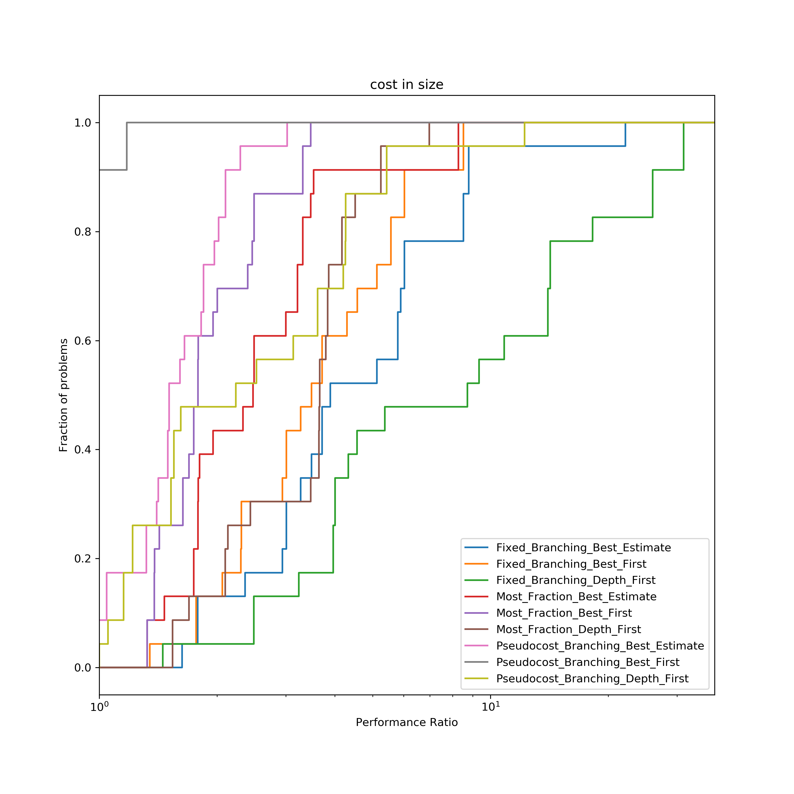

# How to use?

1. Call `bb_perf.py` file from terminal to generate benchmark data, for exmaple `_profile.txt` in this folder.

2. Generate `pd.Dataframe` for analysis.

   ```python
   import pandas as pd
   data_small = pd.read_csv('_profile.txt', delim_whitespace=True)
   df = data_small[0:144]
   ```

   

3. Performe Analysis and plot.

   ```python
   from perfp import calc_perprof, draw_simple_pp
   prob_def = ["Problem"]
   perf_meas = ["Size"]
   solver_char = ["Branch", "Search"]
   taus, solver_vals, solvers, transformed_data = calc_perprof(df, prob_def, perf_meas, solver_char)
   filename = 'profile_fig_time.png'
   draw_simple_pp(taus, solver_vals, solvers, filename)
   ```


You should get some graphs look like




