## Implementation

1. Use the function `generate_training_data_set`, function `generate_testing_data_set`, and class `TinyImageNet` in the `utils.py` to generate train datasets, test datasets and load two datasets respectively. The sampling strategy for training datasets are:
    * Loop through the image database, and treat each image as a query.
    * For the positive image, sample uniformly at random in the same folder of the query image, while sample uniformly at random in the different folder of the query image for the negative image
    * In each epoch, re-sample the whole triplets.
    
2. Due to the testing cost, I trained `resnet50` for 15 epochs without checking the training accuracy and testing accuracy and only record train loss at save the model for each epoch.

3. After finish training for a certain number of epochs, I pass images from the `val` folder to `test.py` to get the test accuracy.

4. For report purpose, use the `val.py`

## Results

* Final **Testing Accuracy: 50.3%: Training Accuracy: 51.1%**

* Training Loss is given below:


```python
import pickle
import matplotlib.pyplot as plt
%matplotlib inline
from PIL import Image
query_list, mytop10, mybottom10, loss = pickle.load(open("./myfinal.p", 'rb'))
```


```python
plt.plot(loss)
plt.xlabel("epoch")
plt.ylabel("train loss")
plt.show()
```


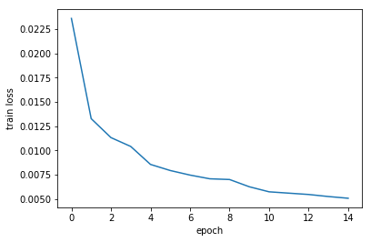


## Query results
Distance is given at the title in the format of `lable/distance`. Here the label is the folder name for each class.

The first two rows are the result for the top10 while the rest two columns are for the bottom 10.


```python

def show_query(query_idx, flag="top"):
    if flag == "top":
        fig, axs = plt.subplots(2,6, figsize=(18, 6))
        fig.subplots_adjust(hspace = .5, wspace=.001)
        count = 0
        for i in [0,1]:
            for j in [0,1,2,3,4,5]:
                if i == 0 and j == 0:
                    img = Image.open(query_list["path"][query_idx])
                    label = query_list["label"][query_idx]
                    axs[i,j].imshow(img)
                    axs[i,j].set_title(label)
                    axs[i,j].axis('off')
                else:
                    if (count <= 9):
                        img = Image.open(mytop10["path"][query_idx][count])
                        label = mytop10["label"][query_idx][count]
                        distance = mytop10["distance"][query_idx][count]
                        axs[i,j].imshow(img)
                        axs[i,j].set_title(label+ "/" +str(str(distance).split("(")[1].split(")")[0]))
                        axs[i,j].axis('off')
                        count += 1
                    else:
                        axs[i,j].axis('off')
    else:
        fig, axs = plt.subplots(2,6, figsize=(18, 6))
        fig.subplots_adjust(hspace = .5, wspace=.001)
        count = 0
        for i in [0,1]:
            for j in [0,1,2,3,4,5]:
                if i == 0 and j == 0:
                    img = Image.open(query_list["path"][query_idx])
                    label = query_list["label"][query_idx]
                    axs[i,j].imshow(img)
                    axs[i,j].set_title(label)
                    axs[i,j].axis('off')
                else:
                    if (count <= 9):
                        img = Image.open(mybottom10["path"][query_idx][count])
                        label = mybottom10["label"][query_idx][count]
                        distance = mybottom10["distance"][query_idx][count]
                        axs[i,j].imshow(img)
                        axs[i,j].set_title(label+ "/" +str(str(distance).split("(")[1].split(")")[0]))
                        axs[i,j].axis('off')
                        count += 1
                    else:
                        axs[i,j].axis('off')

```


```python
show_query(0,flag="top")
show_query(0,flag="bottom")
```


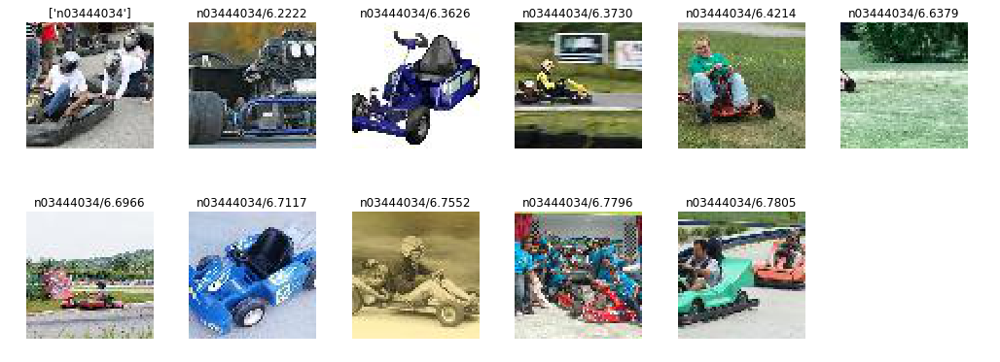


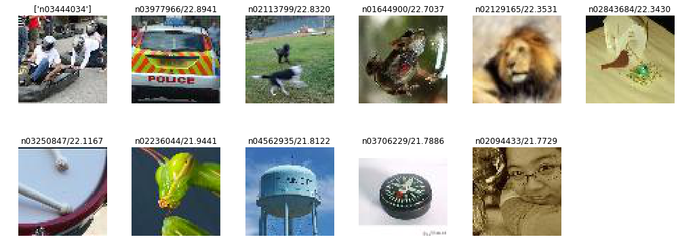


```python
show_query(1,flag="top")
show_query(1,flag="bottom")
```


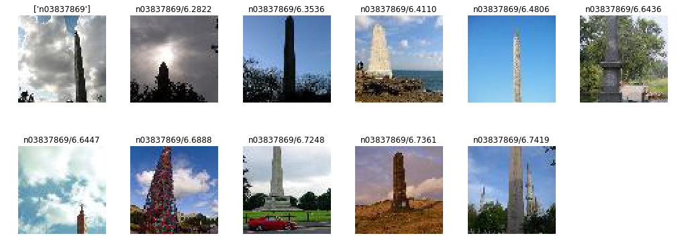


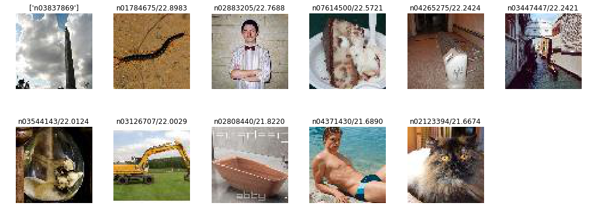


```python
show_query(2,flag="top")
show_query(2,flag="bottom")
```


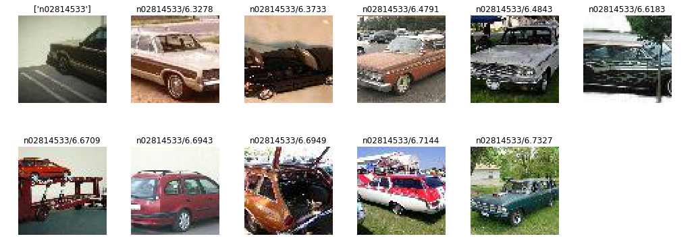


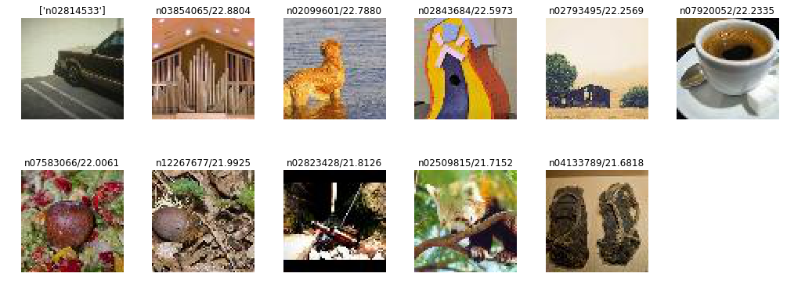


```python
show_query(3,flag="top")
show_query(3,flag="bottom")
```


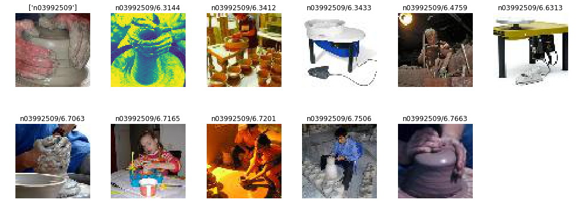


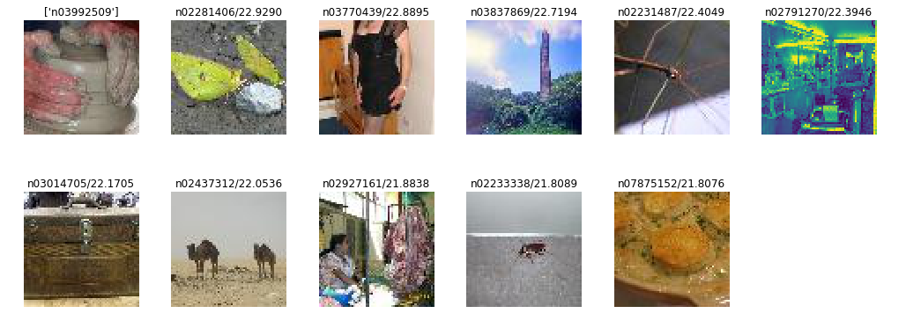


```python
show_query(4,flag="top")
show_query(4,flag="bottom")
```


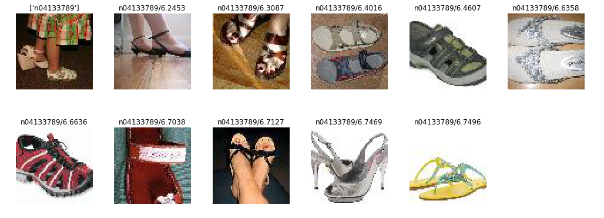


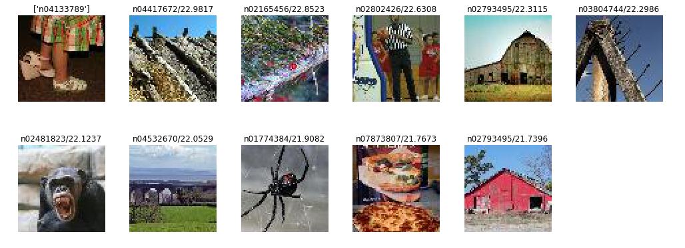


**Note:** By the time I submitted the homework, I fails to finish this part for my trained resnet50, simply because I am running out of the time. So the queried figures and distances are for resnet18, which is trained for 10 epochs with testing accuray 49.8%. But the traning accuracy, testing accuracy and traning loss reported above are for resnet50.

## Improvement

The improvement can be done by fining the sampling strategy. Since we are interested in the figures that most "relevant" to our query. We need to define a relevance score, as suggested by the paper to ensure we can get more positive samples for the given query image.

For every picture $p_i$, it has a class label $c_i$. We define the relevance for $p_i$ and $p_j$ as 

$$
r_{i,j}=\begin{cases}
\text{some pre-calculated number}, & c_i=c_j, i\neq j\\
0, &c_i\neq c_j, i\neq j
\end{cases}
$$

Then we sample the positive sample $p_i^+$ for $p_i$ with following probability from the category $c_i$

$$
P(p_i^+) \propto \min\{T_i, r_{i, i^+}\},
$$

where $T_i$ is a non-negative threshold.


Also, there are two types of negative samples, `in-class-negative` and `out-class-negative`.

For `out-class-negative` $p_i^-$ , just sample uniformly at random while for `in-class-negative`, using $P(p_i^-) \propto \min\{T_i, r_{i, i^-}\}$


