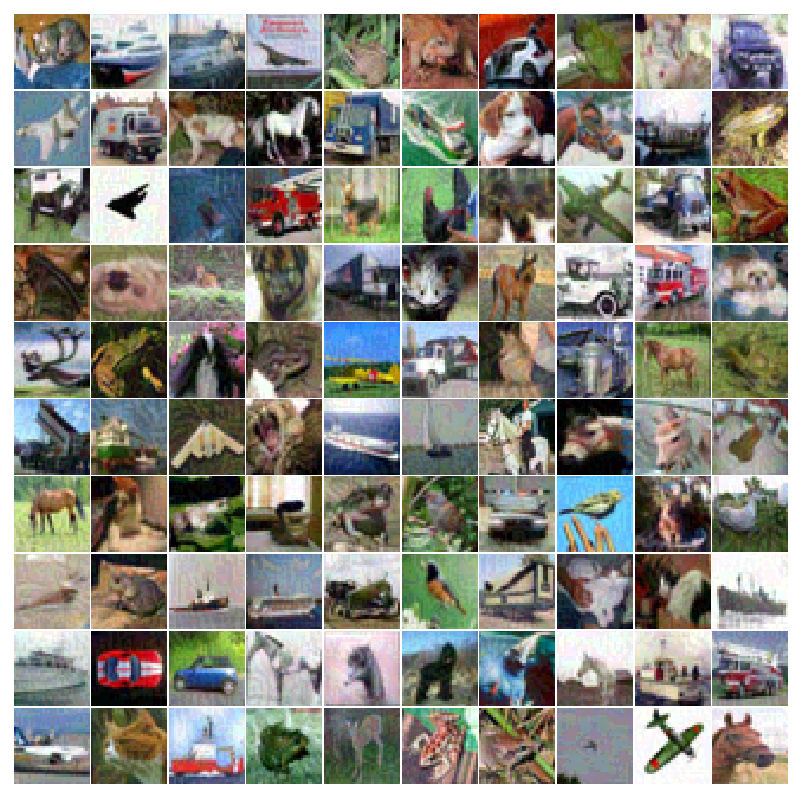
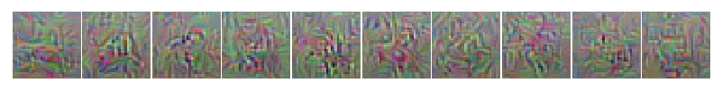
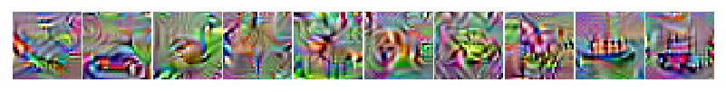
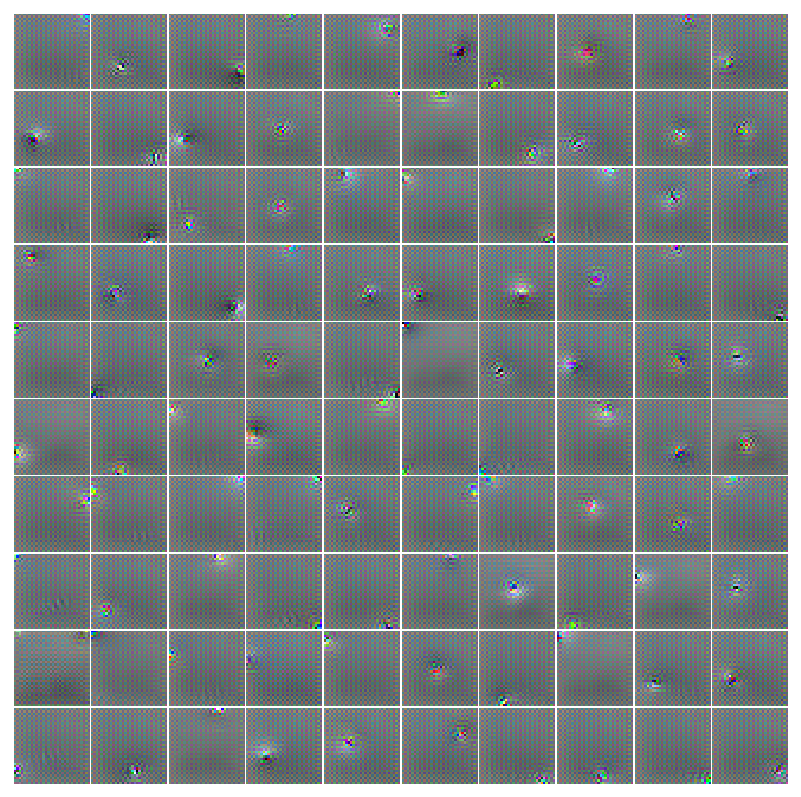
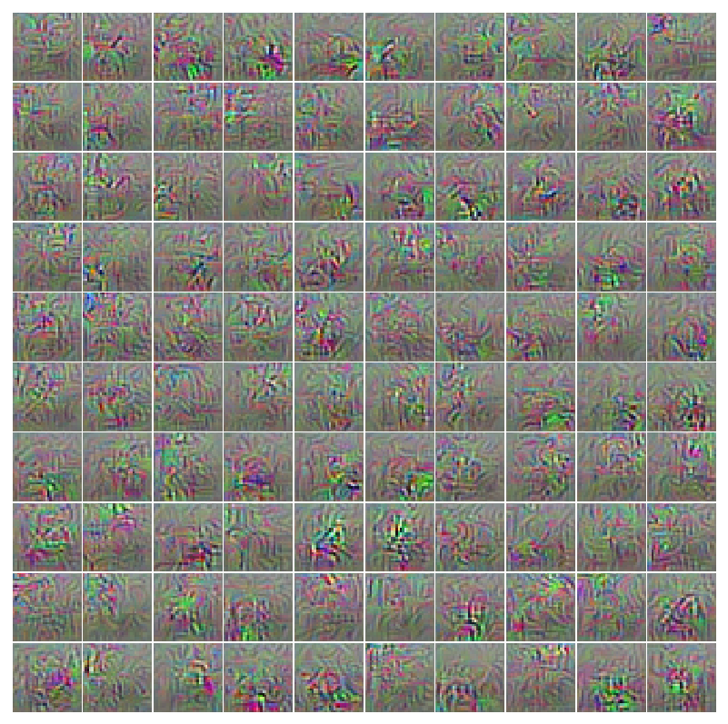
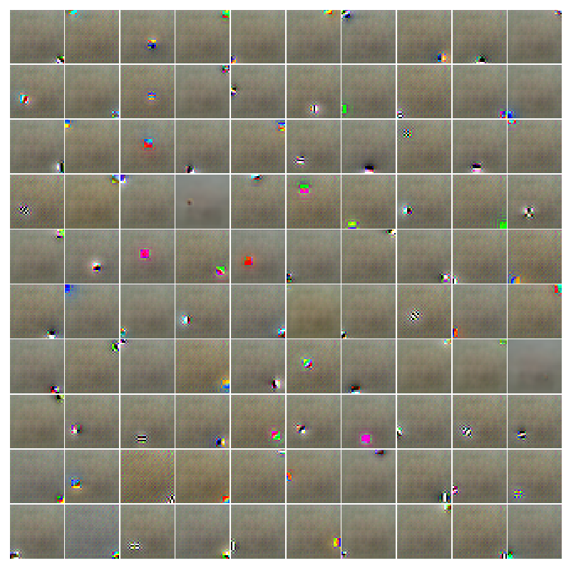
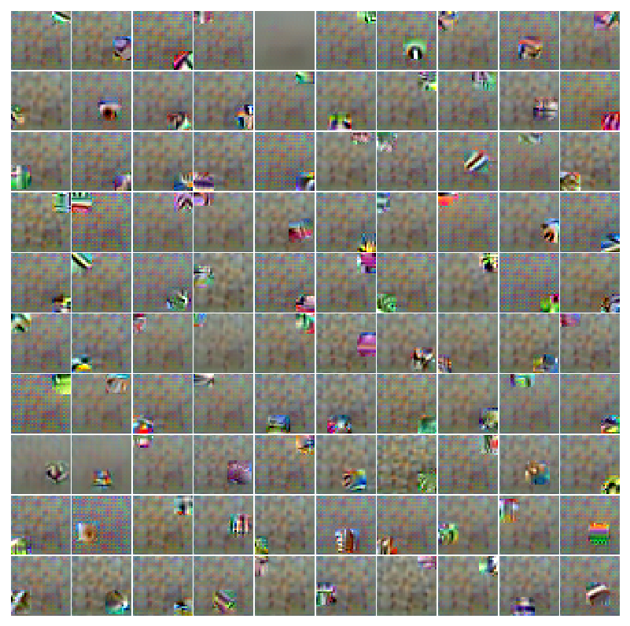
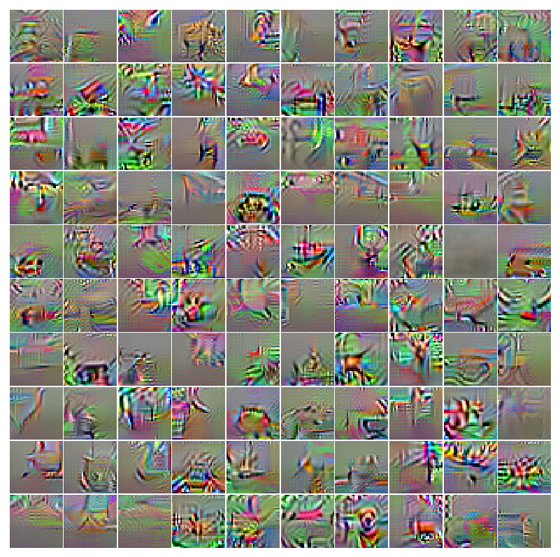

## Test accuracy

I used 196 features and trained the model for 200 epochs on the dataset `CIFAR10` for the `discriminator-with-generator` case, while 100 epochs for `discriminator-without-generator` case. 

* without the generator: **0.872** for 100 epochs.
* with the generator is **0.839** for 200 epochs (historical best is **0.846** on the epoch 192).

## Generated images from the trained Models

The generated images for epoch 1, 50, 100, 150, 200 are given below. Visually, the outputs for classes like, Horse and Truck are relatively good, while they are awful for Cat and Deer.

* Epoch 1
    
    
* Epoch 50
    
    
* Epoch 100
    
    
* Epoch 150

    
* Epoch 200
    
    

# Real vs Perturbed

Real imgaes, their gradients and perturbed images are given below.

* Real Images
    
    
* Gradients
    
    
* Perturbed Images
    
    

## Synthetic Images Maximizing Classification Output

* Synthetic images without generator
    
    

* Synthetic images with generator
    
    

## Synthetic images maximizing features at various layers

* Synthetic images without generator
    * Layer 2
        
    * Layer 4
        
    * Layer 8
        

* Synthetic images with generator
    
    * Layer 2
        
    * Layer 4
        
    * Layer 8
        

